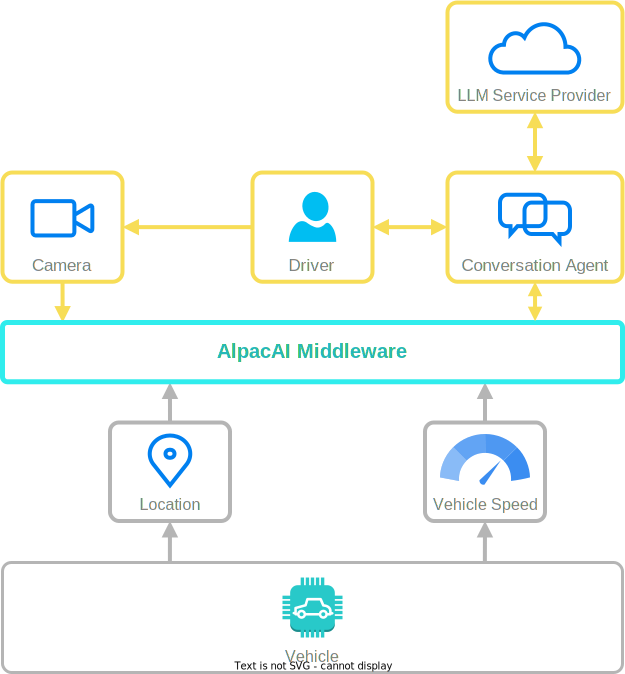
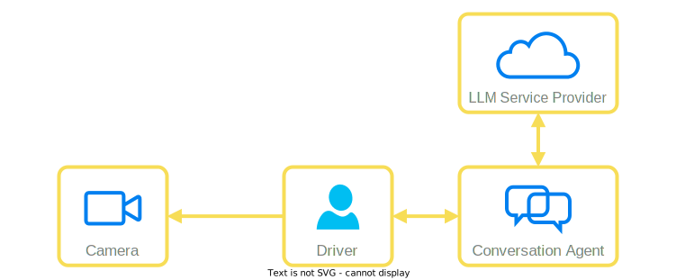
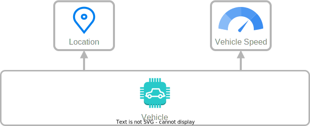

# System Architecture

!!! note
    **DISCLAIMER**: Don't expect a *professional* system architecture!

The **AlpacAI** system originated from a hackathon event, necessitating the architecture to be designed within a rigorous 2 to 2.5-days development timeframe. Consequently, we aimed for simplicity in our architectural approach while ensuring that it remained innovative and cutting-edge.

For a high-level overview of our system, please refer to the following diagram.

 

    

## Basic Idea

Let's break down the architecture into different sections to provide a clear understanding of why we designed it this way initially.

### Core Purpose

In this section, let's focus on the yellow part of the architecture, which we refer to as the **core** purpose of the entire system.

 

    

 

This specific construction is closely tied to the *core* value of the **AlpacAI** system. So, what do we see in this picture?

To ensure a safe driving experience, we aim to detect driver drowsiness using a camera detection approach. The results of this detection are sent to the middleware system for further processing. Based on these results and other information, the decision-making function component determines the activation of the conversation agent.

The *conversation agent* is designed to interact with the driver during the drive to enhance their attention. It engages the driver through different stages based on their attention level:

1. Joyful Ride - Entertainment  
   In this stage, the entertainment system is activated automatically, providing a pleasant experience with music, radio, or podcasts.

2. Knowledgeful Ride  
   Leveraging the vehicle's location, the conversation agent engages the driver with various questions, expecting responses within a certain timeframe.

3. Need Your Attention  
   Similar to the previous stage, but with a shorter response time expected from the driver.

4. Annoy Until You Obey  
   The system activates acoustic alerts, such as vibrating the steering wheel or emitting beeping sounds, to ensure driver compliance.

### Middleware

The middleware is responsible for maintaining the communication between different systems. 

### Vehicle Information

The vehicle information is crucial for the decision-making function component, as it determines how the entire system operates.

 

    

 

The primary information retrieved from the vehicle includes its location and speed.

* Vehicle Location  
  Using the vehicle's location, the conversational agent will gather information about the surrounding area to initiate a conversation with the driver. This interaction can involve insightful questions about famous or historic buildings nearby or any other interesting topics related to the specific area.

* Vehicle Speed  
  This data will be used to set the minimum speed threshold required to activate the conversational agent.